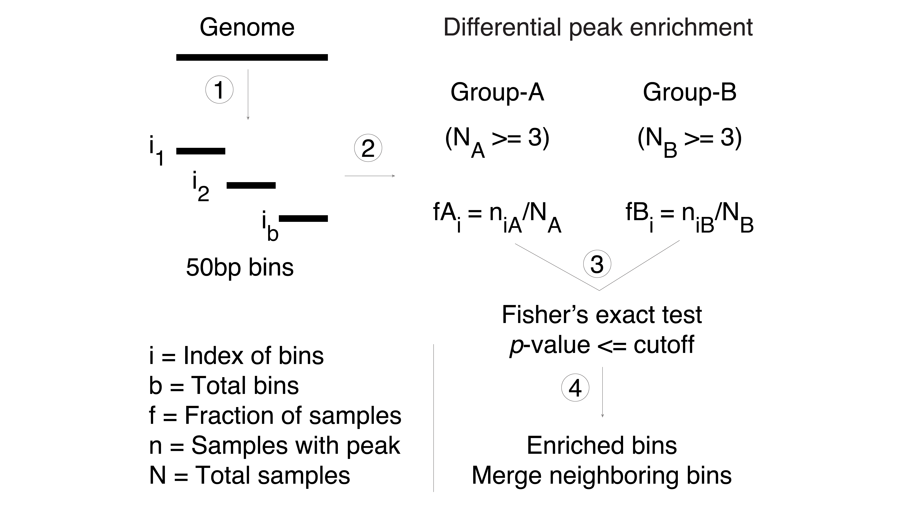

## diffER: Analysis of differentially enriched regions from ChIP-seq peaks

<table>
  <tr>
    <td>
      <h3> Differentially Enriched Regions (diffER)</h3>
      <p>Workflow:</p>
      <ol>
        <li> Split the genome into non-overlapping bins.</li>
        <li> Calculate the number of samples per group that have (or have not) peaks in each bin.</li>
        <li> Fisher’s exact test to identify the differentially enriched bins between two groups.</li>
		<li> Merged the neighboring bins that are differentially enriched.</li>
      </ol>
      <br>
    </td>
    <td>
      
    </td>
  </tr>
</table>

### 1. Requirements 
- python >= 3.8
- Linux

### 2. Installation

 - Clone the repository

```
git clone https://github.com/Rashedul/diffER.git
```

 - Create a virtual environment

```
cd diffER
python -m venv environment
source ./environment/bin/activate
```

 - Install python packages

```
pip install -r requirements.txt
```

### 3. Run diffER

- Provide either a genome build or genome file 
- Example of `--genome_build` is `hg38`, `hg19`, `mm9`, `mm10` etc.  You can check available genomes in `genomepy`. 
- Provide a genome file of your interest. Example of genome file is provided [here](./data/genome_file). 


#### Find option details
```
python diffER.py -h
```

#### Example command with genome build
```
python diffER.py \
    --genome_build hg38 \
    --group_A_beds ./data/sample_A*.bed \
    --group_B_beds ./data/sample_B*.bed \
    --window_size 50
```

#### Example command with genome file 
```
python diffER.py \
    --genome_file ./data/genome_file \
    --group_A_beds ./data/sample_A*.bed \
    --group_B_beds ./data/sample_B*.bed \
    --window_size 50 \
    --out_file diffER_output.bed
```

#### Evaluate output in a heatmap
```
python diffER_heatmap.py \
	--outfile diffER_out.bed \
	--group_A_beds ./data/sample_A*.bed \
	--group_B_beds ./data/sample_B*.bed \
	--filename diffER_heatmap 
``` 

### 4. Notes
- It's recommended to evaluate the output carefylly, particularly for samples with higher sample-to-sample variations. 
- Check your results at different p-values and/or odd ratios. 
- Required number of samples per group is at least 3.

### 5. Contact  
Rashedul Islam, PhD (rashedul.gen@gmail.com)

### 6. Citation
