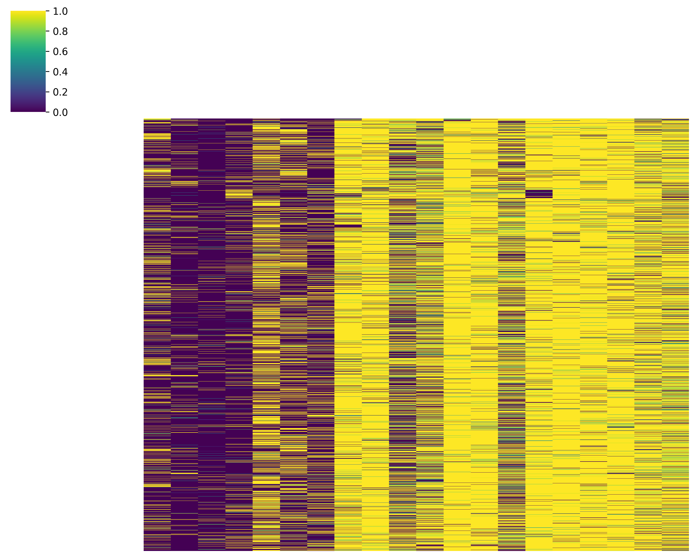
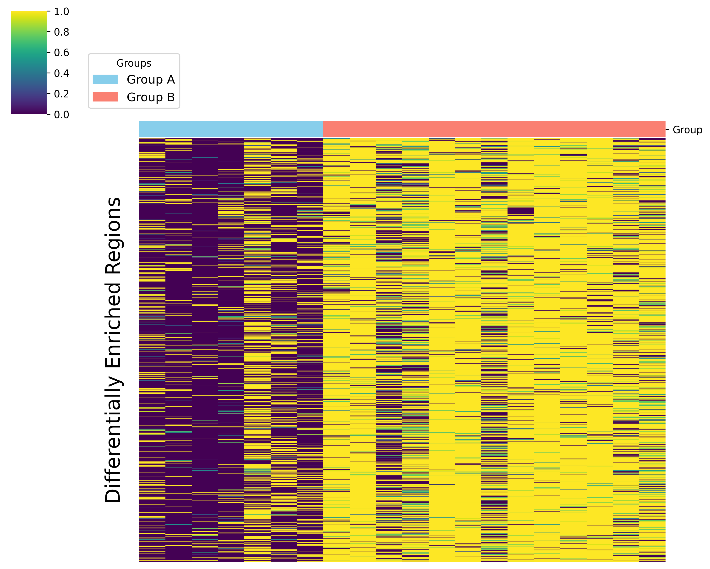

## diffER: Analysis of differentially enriched regions from ChIP-seq peaks

<table>
  <tr>
    <td>
      <h3> Differentially Enriched Regions (diffER)</h3>
      <p>Workflow:</p>
      <ol>
        <li> Split the genome into non-overlapping bins.</li>
        <li> Calculate the number of samples per group that have (or have not) peaks in each bin.</li>
        <li> Fisher’s exact test to identify the differentially enriched bins between two groups.</li>
		<li> Merge the neighboring bins that are differentially enriched.</li>
      </ol>
      <br>
    </td>
    <td>
      
    </td>
  </tr>
</table>

### 1. Requirements 
- python >= 3.10
- Linux
- macOS >= 13.5

### 2. Installation

 - Clone the repository

```
git clone https://github.com/Rashedul/diffER.git
```

 - Create a virtual environment

```
cd diffER
python -m venv environment
source ./environment/bin/activate
```

 - Install python packages

```
pip install -r requirements.txt
```

### 3. Run diffER

#### Note:
- Provide a `--genome_file` of your interest. Example of a genome file is provided [here](./data/CHROMSIZES_hg38.txt). 
- Alternatively, `--genome_build` such as `hg38`, `hg19`, `mm9`, `mm10` etc. can be used. Find the available genomes in `pybedtools`.
```
import pybedtools
pybedtools.genome_registry.hg38
or
pybedtools.chromosomesizes("hg38")
```
- `--group_A_beds` and `--group_B_beds` bed files can be provided as list and/or wildcard (`*`) character. 
- Required number of samples per group is at least 4.

#### Usage
```
python diffER.py -h

Usage:
    python diffER.py [--genome_build GENOME_BUILD | --genome_file GENOME_FILE] --group_A_beds GROUP_A_BEDS [--group_B_beds GROUP_B_BEDS] [--window_size WINDOW_SIZE] [--p_value P_VALUE] [--distance DISTANCE] [--outfile OUTFILE] [--outdir OUTDIR]  

Arguments:
  -h, --help            show this help message and exit
  --genome_build GENOME_BUILD
                        Input genome build name
  --genome_file GENOME_FILE
                        Input genome file
  --group_A_beds GROUP_A_BEDS [GROUP_A_BEDS ...]
                        Input group A BED files [required]
  --group_B_beds GROUP_B_BEDS [GROUP_B_BEDS ...]
                        Input group B BED files [required]
  --window_size WINDOW_SIZE
                        Size of the windows; default [50]
  --p_value P_VALUE     p-value threshold for Fisher's exact test; default [0.05]
  --distance DISTANCE   Maximum distance between intervals allowed to be merged; default [100]
  --outfile OUTFILE     Output file prefix; default [diffER]
  --outdir OUTDIR       Output direcory name; default [current direcory]
```

#### Example command with genome file (hg38:chr10)
```
python diffER.py \
    --genome_file ./data/CHROMSIZES_hg38_chr10.txt \
    --group_A_beds ./data/uCLL/*.bed \
    --group_B_beds ./data/mCLL/*.bed 
```

#### Example command with genome build 
```
python diffER.py \
    --genome_build hg38 \
    --group_A_beds ./data/uCLL/*.bed \
    --group_B_beds ./data/mCLL/*.bed
```

#### Output files
- For each of the two groups, there are two output bed files containing enriched regions. 
- The output files contail n columns such as `chr` `start` `end` 

```
  - diffER_group_A_enriched_regions.bed 
  - diffER_group_B_enriched_regions.bed
```

#### Note:

- Depending on the assay, you may want to exclude regions shorter than a specified length. For instance, we recommend filtering out regions under 300bp for broad marks.

### 4. Plot healmap

- You may experiment with different p-values and assess quality by visualizing the results in a heatmap or profile plot. You can use `plot_heatmap.py` to generate a heatmap. 

```
python plot_heatmap.py -i diffER_group_A_enriched_regions.bed -s "./data/*CLL/*.bed" -o output.csv -img heatmap1

python plot_heatmap.py -i diffER_group_B_enriched_regions.bed -s "./data/*CLL/*.bed" -o output2.csv -img heatmap2
```

<div style="display: flex; justify-content: space-between;">
  
  
</div>

- Heatmaps for group_A (n=7) and group_B (n=13) enriched regions.
- The fraction of enriched regions occupied by peaks is used to generate heatmaps.

### 5. Contact  
Rashedul Islam, PhD (rashedul.gen@gmail.com)

### 6. Citation  


